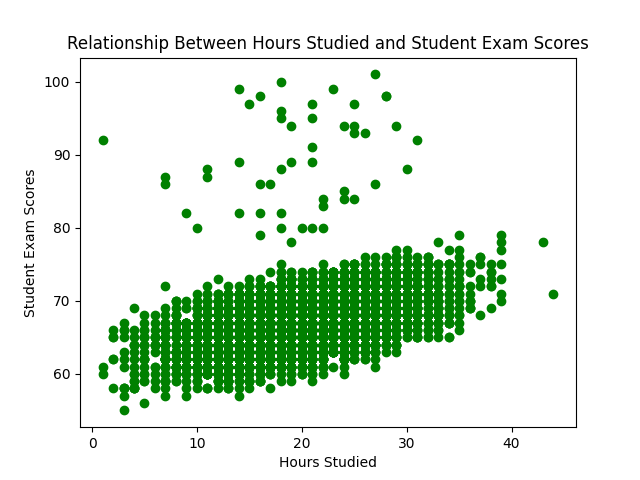

# Rishika Randev's Pandas Descriptive Script for IDS706 Week 3

## ☑️ Requirements (Mini Project 2 & Individual Project 1):
1. Jupyter notebook performing descriptive statistics & tested with nbval plugin
2. Python script for statistics and generating one data visualization
3. Summary pdf or markdown file
4. Makefile that installs required packages, formats, lints, and tests
5. requirements.txt
6. Python testing scripts
7. Successful CI/CD badges

## ☑️ The Dataset

## ☑️ Steps
1. Prepare the necesary configuration files like the Dockerfile, devcontainer.json, Makefile, requirements.txt, and main.yml for GitHub Actions integration. Ensure that the requirements.txt lists all necessary packages (for example, matplotlib for visualizing and pandas for data manipulation).
2. Create a main.py script with two functions--
   * generate_summary_stats(csv): reads in any csv file passed to it into a pandas dataframe and then generates summary statistics (mean, median, mode, standard deviation) for its columns.
   * generate_data_viz(csv): reads in the csv file, creates a scatterplot of Hours Studied vs. Exam Score using matplotlib, and saves it as a png file (performance.png).
3. Create a test_main.py script with two functions--
   * test_generate_summary_stats(csv): calls generate_summary_stats() using the student performance factors csv file to validate a few of the sample statistics generated by this function.
     
   )
   * test_generate_data_viz(csv): calls generate_data_viz() using the student performance factors csv file in order to produce the below scatterplot.
     
     
   

